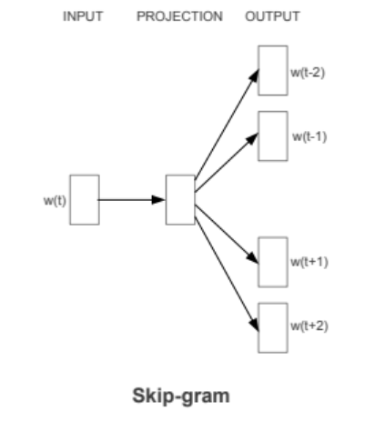

# SkipGram Word2Vec Model with SGNS

This project implements the SkipGram Word2Vec model using SkipGram with Negative Sampling (SGNS), on a Numpy structure (instead of an NN structure). The main components of the project include data preprocessing, training the model, and performing word analogy and similarity tasks. The model can be trained on any text corpora provided by the user.



## Project Structure

- `skipgram_sgns.py`: Contains the SkipGram class and supporting functions for training and evaluating the model.
- `tests_drSeuss.py`: Contains tests for the SkipGram model and its methods on the drSeuss corpus in Corpora.
- `tests_harryPotter.py`: Contains tests for the SkipGram model and its methods on the harryPotter corpus in Corpora.
- `unittests_skipgram.py`: Contains general unittests for the SkipGram model and its methods. You can activate by passing the txt file path in the terminal.
- `Corpora/`: Directory to store text corpora for training the model.

## Setup and Installation

1. **Clone the Repository**

    ```bash
    git clone https://github.com/your-repo/skipgram-sgns.git
    cd skipgram-sgns
    ```

2. **Install Dependencies on Virtual Enviroment**

    ```bash
    python -m venv venv
    venv\Scripts\Activate
    python -m pip install --upgrade pip
    pip install -r requirements.txt
    ```

3. **Run tests**

    ```bash
    python unittest_skipgram.py {file_path}
    ```

    For example (for structure tests):

    ```bash
    python unittest_skipgram.py Corpora/drSeuss.txt
    python unittest_skipgram.py Corpora/harryPotter1.txt
    ```
    or (for specific embedding tests per corpus)

   ```bash
    python tests_drSeuss.py
    python tests_harryPotter.py
    ```
